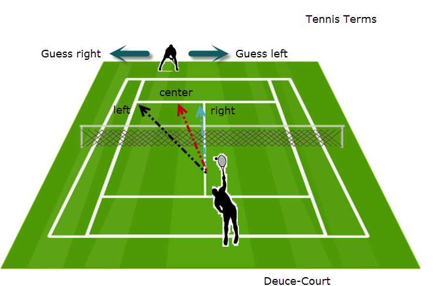

```{r}
library(ggplot2)
library(reshape2)
library(plyr)
library(dplyr)
```

Generate figures to help explain game theory analysis

We want to take a look at a tennis match from the perspective of game theory. In order to do this we will make some simplifying assumptions.

1. The main factor in determining the winner of a point is where the serve is placed
2. There are two distince scenarios that present two distince games:

* Deuce-court
    + Server has choice of serving left or right
    + Receiver has choice of guessing left or right
    


* Ad-court
    + Server has choice of serving left or right
    + Receiver has choice of guessing left or right


The option that is ignored is the center serve (from either court), since that rarely occurs.

For each game we would expect there to be an equilibrium point. For example, the deuce-court serve might look like this:


```{r echo=FALSE, fig.align='center', fig.width=8, fig.height=6}

# Model parameters
sv_lf.rc_lf <- .9; sv_lf.rc_rt <- .65
sv_rt.rc_lf <- .7; sv_rt.rc_rt <- .80

model.prob <- c(sv_lf.rc_lf,   sv_lf.rc_rt,
                sv_rt.rc_rt, sv_rt.rc_rt)

# Conflict Matrix:
# |             | Receive left | Receive Right |
# |-------------|:------------:|:-------------:|
# |  Serve Left |  sv_lf.rc_lf |  sv_lf.rc_rt  |
# | Serve Right |  sv_rt.rc_lf |  sv_rt.rc_rt  |

conflict.matrix <- matrix(data=model.prob, nrow = 2, byrow = TRUE)

# Create data frame
sv <- c(0, 0, 1, 1)
rc <- c(0, 1, 0, 1)

model.df <- data.frame(model.prob=model.prob, sv=sv, rc=rc)
  
# Create data frame
x <- c(0, 0, 1, 1)

l <- c(rep("Receiver guesses right", 4))
l[seq(1, 4, by=2)] <- "Receiver guesses left"

df <- data.frame(x=x, y=y, line=l)

# Equilibrium point
d.r1 <- abs(diff(conflict.matrix[1,]))
d.r2 <- abs(diff(conflict.matrix[2,]))
d.c1 <- abs(diff(conflict.matrix[,1]))
d.c2 <- abs(diff(conflict.matrix[,2]))
serve_right.eq <- d.r1 / (d.r1 + d.r2)
receive_right.eq <- d.c2 / (d.c1 + d.c2)

ex.server <- as.numeric(conflict.matrix[,1]  %*% c(1 - serve_right.eq, serve_right.eq))

# Plotting parameters
b <- (1:5)*20/100
ann_size <- 4

p <- ggplot(df, aes(x=x, y=y)) + 
  geom_rect(aes(xmin=0, xmax=1, ymin=0, ymax=1), fill="white", alpha=.2) + 
  geom_line(aes(color=line), size=1.5) +
  geom_point(size = 4) +
  annotate("text", label = "Serve left\nGuess right",  
           x=x[1], y=sv_lf.rc_rt,  hjust= 0.0, vjust=  1.3,
           size=ann_size) +
  annotate("text", label = "Serve left\nGuess left",   
           x=x[2], y=sv_lf.rc_lf,   hjust= 0.0, vjust= -.3,
           size=ann_size) +
  annotate("text", label = "Serve right\nGuess left",  
           x=x[3], y=sv_rt.rc_lf,  hjust= 1.1, vjust= 1.3,
           size=ann_size) +
  annotate("text", label = "Serve right\nGuess right", 
           x=x[4], y=sv_rt.rc_rt, hjust= 1.1, vjust= -0.3,
           size=ann_size) +
  annotate("segment", x=0.05,    xend=serve_right.eq, y=ex.server, yend=ex.server, linetype=2) + 
  annotate("segment", x=serve_right.eq, xend=serve_right.eq, y=0,         yend=ex.server, linetype=2) +
  annotate("text", label=round(ex.server, 2), x=0, y=ex.server, hjust=.5) +
  annotate("text", label=round(serve_right.eq, 2), x=serve_right.eq, y=0, vjust=1.5) +
  ggtitle("Deuce-court Serve") +
  xlab("Probability Server serves right") + 
  scale_x_continuous(breaks=b) +
  ylab("Probability point won by Server") +
  scale_y_continuous(breaks=b) +
  theme(plot.title = element_text(face="bold", size=20)) + 
  scale_color_manual(name = "Receiver actions",
                     values = c("#1b9e77", "#d95f02"))

# Turn off clipping
gt <- ggplot_gtable(ggplot_build(p))
gt$layout$clip[gt$layout$name == "panel"] <- "off"
plot(gt)

```


From paper:

Match 82: Wimbldn, Conners, McEnroe  

Conners, Ad:   
  Serves: L - 32, R - 46, Total - 48  
  Points: L - 16, R - 32  
  
Pearson statisitc = 3.052  
p-value = 0.081  

Let's make sure I can match this calculation:  

|         | Win    |  Lose |        |
|---------|--------|-------|--------|
| Serve L | **16** | 16    | **32** |
| Serve R | 32     | 14    | **46** |
|         | 48     | 30    | **78** |

```{r}
values <- c(16, 16, 32, 14)
m <- matrix(values, nrow=2, byrow=TRUE)
chisq.test(m, correct=FALSE)
```

These values match the paper

```{r}
simulate.games <- function(sv_lf.rc_lf, 
              					   sv_lf.rc_rt,
            						   sv_rt.rc_lf,
            						   sv_rt.rc_rt,
            						   serve_right.actual,
            						   receive_right.actual,
            						   n.trials){
  
  # Serve left(0) or right(1)
  serve <- rbinom(n.trials, 1, serve_right.actual)
  receive <- rbinom(n.trials, 1, receive_right.actual)
  
  point.results <- data.frame(serve=serve, receive=receive, server.wins=NA)
  
  filter.sv_lf.rc_lf <-   point.results$serve == 0 & point.results$receive == 0
  filter.sv_lf.rc_rt <-  point.results$serve == 0 & point.results$receive == 1
  filter.sv_rt.rc_lf <-  point.results$serve == 1 & point.results$receive == 0
  filter.sv_rt.rc_rt <- point.results$serve == 1 & point.results$receive == 1
  
  point.results$server.wins[filter.sv_lf.rc_lf] <- 
   rbinom(sum(filter.sv_lf.rc_lf), 1, sv_lf.rc_lf)
  
  point.results$server.wins[filter.sv_lf.rc_rt] <- 
   rbinom(sum(filter.sv_lf.rc_rt), 1, sv_lf.rc_rt)
  
  point.results$server.wins[filter.sv_rt.rc_lf] <- 
   rbinom(sum(filter.sv_rt.rc_lf), 1, sv_rt.rc_lf)
  
  point.results$server.wins[filter.sv_rt.rc_rt] <- 
   rbinom(sum(filter.sv_rt.rc_rt), 1, sv_rt.rc_rt)
  
  return(point.results)
}

```

```{r}
# Set parameters
n.trials <- 1000

use.eq <- TRUE
if(use.eq){
  serve_right.actual <- serve_right.eq
  receive_right.actual <- receive_right.eq
} else{
  serve_right.actual <- 0
  receive_right.actual <- 0
}

r1 <- simulate.games(sv_lf.rc_lf,
                     sv_lf.rc_rt,
                     sv_rt.rc_lf,
                     sv_rt.rc_rt,
                     serve_right.actual,
                     receive_right.actual,
                     n.trials)

# Take a look at the results
mean(r1$server.wins[r1$serve == 1])
mean(r1$server.wins[r1$serve == 0])

mean(r1$server.wins)

#____________________Col 0 - Point lost | Col 1 - Point Won
# Row 0 - Serve Left
# Row 1 - Serve Right

m <- table(r1$serve, r1$server.wins)

chisq.test(m, correct=FALSE)
```

What does a heat map of this look like?
Let's look at a heat map of the serves expected win ratio for all combinations of serving left or right and all combinations of the receiver guessing left or right.


```{r fig.width=8, fig.height=2.5}

increment <- 0.025
s <- seq(0, 1, increment)
r <- seq(0, 1, increment)

df <- data.frame(expand.grid(s, r))
names(df) <- c("s", "r")

f <- function(s, r, num.trials){
  r <- simulate.games(sv_lf.rc_lf, 
                      sv_lf.rc_rt,
                      sv_rt.rc_lf,
                      sv_rt.rc_rt,
                      s, r, num.trials)
  return(mean(r$server.wins))
}

n.trials <- c(100, 1000, 10000) # , 50000)
# n.trials <- c(10, 50, 100)
# n.trials <- c(100000)
size.effect = data.frame()

for(n.trials.value in n.trials){
  df <- ddply(df, .(s, r), transform,
            ev = f(s, r, n.trials.value), 2)
  df$trials <- n.trials.value
  size.effect <- plyr::join(size.effect, df, type="full")
}

ev.min <- min(size.effect$ev)
ev.max <- max(size.effect$ev)
b <- c(seq(from=ev.min,            to=ex.server - 0.005, length.out=5), 
       seq(from=ex.server + 0.005, to=ev.max,           length.out=5))

size.effect$ev.bin <- cut(size.effect$ev, breaks=b)

ggplot(size.effect, aes(x=r, y=s)) + 
  geom_tile(aes(fill=ev.bin)) + 
  facet_grid(. ~ trials) +
  scale_fill_brewer(palette = "YlGnBu")
  

```

We can see that equilibrium play is achieved when the server serves 75% right and the receiver guesses 50% right. We can also see that we need to look at a lot of games to reduce noise.

Since we can't observe which way the receiver is guessing we will use the pearson statistic as a surrogate. Looking at the chi squared value in the same manner we have:

```{r fig.width=8, fig.height=2.5}

increment <- 0.025
s <- seq(0, 1, increment)
r <- seq(0, 1, increment)

df <- data.frame(expand.grid(s, r))
names(df) <- c("s", "r")

f <- function(s, r, num.trials){
  r <- simulate.games(sv_lf.rc_lf, 
                      sv_lf.rc_rt,
                      sv_rt.rc_lf,
                      sv_rt.rc_rt,
                      s, r, num.trials)
  #____________________Col 0 - Point lost | Col 1 - Point Won
  # Row 0 - Serve Left
  # Row 1 - Serve Right
  
  m <- table(r$serve, r$server.wins)
  
  return(chisq.test(m, correct=FALSE)$p.value)
}

n.trials <- c(100, 1000, 10000) # , 50000)
# n.trials <- c(10, 50, 100)
n.trials <- c(10000)
size.effect = data.frame()

for(n.trials.value in n.trials){
  df <- ddply(df, .(s, r), mutate,
            chi = f(s, r, n.trials.value), 2)
  df$trials <- n.trials.value
  size.effect <- plyr::join(size.effect, df, type="full")
}

# cap <- 4
# size.effect$chi.capped <- size.effect$chi
# size.effect$chi.capped[size.effect$chi > cap] <- cap + 1
# size.effect$log.chi <- log(size.effect$chi)

ggplot(size.effect, aes(x=r, y=s)) + 
  geom_tile(aes(fill=chi)) + 
  facet_grid(. ~ trials)
#   scale_fill_brewer(palette = "YlGnBu")
  

```

