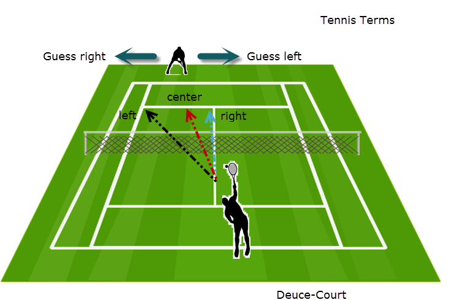
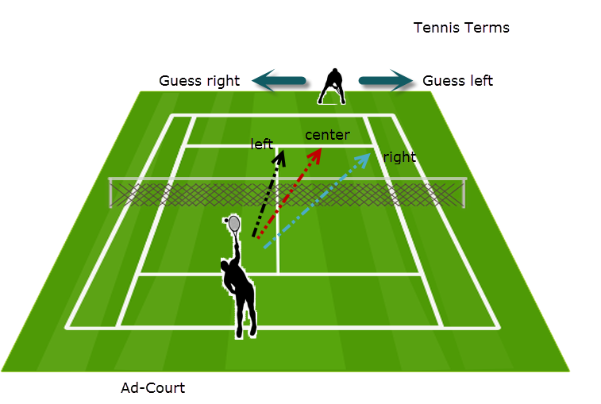

```{r include}
library(ggplot2)
library(reshape2)
library(plyr)
```

Objective: Generate figures to help explain game theory analysis

# Assumptions and Terms

We want to take a look at a tennis match from the perspective of game theory. In order to do this we will make some simplifying assumptions.

1. The main factor in determining the winner of a point is where the serve is placed
2. There are two distinct scenarios that present two distinct games:

* Deuce-court
    + Server has choice of serving left or right
    + Receiver has choice of guessing left or right
    


$$ \text{Figure 1} $$

* Ad-court
    + Server has choice of serving left or right
    + Receiver has choice of guessing left or right



$$ \text{Figure 2} $$

The option that is ignored is the center serve (from either court), since that rarely occurs.

For each game we would expect there to be an equilibrium point. For example, the deuce-court serve might look like this:


```{r model_params, echo=FALSE}

# Model parameters
# Probabilities for server winning point
# serve: sv, receive: rc, left: lf, right: rt
# e.g.: sv_lf.rc_rt: serve_left.receive_right

model.df <- data.frame(prob    = c( 0.9,          0.65,          0.7,           0.80),
                       sv      = c( 0.0,          0.0,           1.0,           1.0),
                       rc      = c( 0.0,          1.0,           0.0,           1.0),
                       desc.sv = c("Serve Left", "Serve Left",  "Serve Right", "Serve Right"),
                       desc.rc = c("Guess Left", "Guess Right", "Guess Left",  "Guess Right"),
                       hj      = c( 0.0,          0.0,           1.1,           1.1),
                       vj      = c(-0.3,          1.3,           1.3,          -0.3))

model.df$desc <- paste(model.df$desc.sv, model.df$desc.rc, sep="\n")

# Conflict Matrix:
# |             | Receive left | Receive Right |
# |-------------|:------------:|:-------------:|
# |  Serve Left |  sv_lf.rc_lf |  sv_lf.rc_rt  |
# | Serve Right |  sv_rt.rc_lf |  sv_rt.rc_rt  |

conflict.matrix <- matrix(data=model.df$prob, nrow = 2, byrow = TRUE)

# Equilibrium point
d.r1 <- abs(diff(conflict.matrix[1,]))
d.r2 <- abs(diff(conflict.matrix[2,]))
d.c1 <- abs(diff(conflict.matrix[,1]))
d.c2 <- abs(diff(conflict.matrix[,2]))
sv_rt.eq <- d.r1 / (d.r1 + d.r2)
rc_rt.eq <- d.c1 / (d.c1 + d.c2)

# Expected value of game (server)
ex.sv <- as.numeric(conflict.matrix[,1]  %*% c(1 - sv_rt.eq, sv_rt.eq))
```

```{r classic_game_theory_figure, echo=FALSE, fig.align='center'}
# , fig.width=8, fig.height=6

# Plotting parameters
b <- (1:5)*20/100
ann_size <- 4

# Generate Plot
p <- ggplot(model.df, aes(x=sv, y=prob, label=desc)) + 
  geom_rect(aes(xmin=0, xmax=1, ymin=0, ymax=1), fill="white", alpha=.2) + 
  geom_line(aes(group=rc, color=desc.rc), size=1.5) +
  geom_point(size = 4) +
  geom_text(aes(hjust=hj, vjust=vj)) +
  annotate("segment", x=0.05,    xend=sv_rt.eq, y=ex.sv, yend=ex.sv, linetype=2) + 
  annotate("segment", x=sv_rt.eq, xend=sv_rt.eq, y=0,  yend=ex.sv, linetype=2) +
  annotate("text", label=round(ex.sv, 2), x=0, y=ex.sv, hjust=.5) +
  annotate("text", label=round(sv_rt.eq, 2), x=sv_rt.eq, y=0, vjust=1.5) +
  ggtitle("Deuce-court Serve") +
  xlab("Probability Server serves right") + 
  scale_x_continuous(breaks=b) +
  ylab("Probability point won by Server") +
  scale_y_continuous(breaks=b) +
  theme(plot.title = element_text(face="bold", size=20)) + 
  scale_color_manual(name = "Receiver actions",
                     values = c("#1b9e77", "#d95f02"))

# Turn off clipping
gt <- ggplot_gtable(ggplot_build(p))
gt$layout$clip[gt$layout$name == "panel"] <- "off"

# Display
plot(gt)

```

$$ \text{Figure 3. Shows assumed values for this game.} $$

# Simulation

We will use simulation to explore the game space in an effort to determine how to evaluate whether or not a real tennis match is being played in equilibrium.

## Simulation function

Create a funtion to simulate results of a specified number of games.  

We will first create a vector, serve, of serves modeled with a binomial distribution with parameters n and p where n = 1 (right=1, left=0) and p = {probability server serves right}, input at runtime.

We will also create a vector, receive, of receiver guesses modeled with a binomial distribution with parameters n and p where n = 1 (right=1, left=0) and p = {probability receiver guesses right}, also input at runtime. NOTE: right refers to a direction, not a correctness. See Figure 1.

We will assume the values given in Figure 3.  

| Serve Direction | Receiver Guesses | Probability Server Wins Point |
|-----------------|------------------|-------------------------------|
| Left            | Left             | `r model.df$prob[1]`          |
| Left            | Right            | `r model.df$prob[2]`          |
| Rigth           | Left             | `r model.df$prob[3]`          |
| Right           | Right            | `r model.df$prob[4]`          |

$$ \text{Table 1} $$

We can now break out the 4 combinations of the serve and receive vectors and generate 4 different vectors modeled as binomial sequences with parameters n and p where n = 1 (win=1, lose=0) and p is given in Table 1.

Putting everything back together we now have our simulation that consists of three vectors:

* serve (1=right, 0=left)
* receive (1=guess right, 0=guess left)
* outcome (1=server wins, 0=server loses)

```{r sim_function}

simulate.points <- function(probs, sv_rt.act, rc_rt.act, n.pts){  
  # ==============================================================
  # Unroll probabilities    # Probability server wins when:
                            # |--------------|-------------------|
                            # | Server       | Receiver          |
                            # |--------------|-------------------|
  sv_lf.rc_lf <- probs[1]   # | Serves left  | Guesses left      |
  sv_lf.rc_rt <- probs[2]   # | Serves left  | Guesses right     |
  sv_rt.rc_lf <- probs[3]   # | Serves right | Guesses left      |
  sv_rt.rc_rt <- probs[4]   # | Serves right | Guesses right     |
  
  # sv_rt.act = Probability server serves right
  # rc_rt.act = Probability receiver guesses right
  # ** these do not have to equal equilibrium values
  
  # n.pts = number of points to simulate
  # ==============================================================
  
  # Simulate serves and receive-guesses
  # Serve left = 0, Serve right = 1
  # Guess left = 0, Guess right = 1
  sv <- rbinom(n.pts, 1, sv_rt.act)
  rc <- rbinom(n.pts, 1, rc_rt.act)
  
  # Simulate winner of point based on given probabilities
  # sv.wins = 1, server wins
  # sv.wins = 0, server loses
  point.results <- data.frame(sv=sv, rc=rc, sv.wins=NA)
  
  # Create filters for the four combinations:
  f.sv_lf.rc_lf <- sv == 0 & rc == 0     # Serve left  - Guess left
  f.sv_lf.rc_rt <- sv == 0 & rc == 1     # Serve left  - Guess right
  f.sv_rt.rc_lf <- sv == 1 & rc == 0     # Serve right - Guess left
  f.sv_rt.rc_rt <- sv == 1 & rc == 1     # Serve right - Guess right
  
  # Simulate results:                            Number of points       Prob of winning
  point.results$sv.wins[f.sv_lf.rc_lf] <- rbinom(sum(f.sv_lf.rc_lf), 1, sv_lf.rc_lf)
  point.results$sv.wins[f.sv_lf.rc_rt] <- rbinom(sum(f.sv_lf.rc_rt), 1, sv_lf.rc_rt)
  point.results$sv.wins[f.sv_rt.rc_lf] <- rbinom(sum(f.sv_rt.rc_lf), 1, sv_rt.rc_lf)
  point.results$sv.wins[f.sv_rt.rc_rt] <- rbinom(sum(f.sv_rt.rc_rt), 1, sv_rt.rc_rt)
  
  return(point.results)
}

```

## Explore simulation results

### Server at Equilibrium, Receiver at Equilibrium, 300 points

```{r test_sim_1, echo=FALSE}
# Set parameters
n.points <- 300

use.eq <- TRUE

if(use.eq){
  serve_right.actual <- sv_rt.eq
  receive_right.actual <- rc_rt.eq
} else{
  serve_right.actual <- .6
  receive_right.actual <- 0.1
}

# Run simulation
sim.test <- simulate.points(model.df$prob, serve_right.actual, receive_right.actual, n.points)

# ===============================================================================================
# Fill in text parameters for summary below:
# -----------------------------------------------------------------------------------------------
if(use.eq){
  use.not_use <- "used"
  expect.not_expect <- "expect"
} else{
  use.not_use <- "did not use"
  expect.not_expect <- "do not expect"
}
sim.prob.serve.right    <- round(mean(sim.test$sv == 1), 2)
sim.prob.receive.right  <- round(mean(sim.test$rc == 1), 2)

sim.prob.win.right   <- round(mean(sim.test$sv.wins[sim.test$sv == 1]), 2)
sim.prob.win.left    <- round(mean(sim.test$sv.wins[sim.test$sv == 0]), 2)
sim.prob.win.overall <- round(mean(sim.test$sv.wins)                  , 2)

#                                             0=left, 1=right  || 0=lose, 1=win
sim.count.left.lose  <- sum(sim.test$sv.wins[sim.test$sv == 0] == 0)
sim.count.left.win   <- sum(sim.test$sv.wins[sim.test$sv == 0] == 1)
sim.count.right.lose <- sum(sim.test$sv.wins[sim.test$sv == 1] == 0)
sim.count.right.win  <- sum(sim.test$sv.wins[sim.test$sv == 1] == 1)

# Use the chi squared test to determine if Serve Direction is independent of winning point

# |------------------|-------------------|-------------------|
# |                  | Point lost        | Point Won         |
# |------------------|-------------------|-------------------|
# | Serve Left       | count(lost|left)  | count(won|left)   |
# |------------------|-------------------|-------------------|
# | Serve Right      | count(lost|right) | count(won|right)  |
# |------------------|-------------------|-------------------|

m <- table(sim.test$sv, sim.test$sv.wins)

sim.result.chi <- chisq.test(m, correct=FALSE)
# ===============================================================================================
```

Simulation Parameters:  

Assumed values:

| Serve Direction | Receiver Guesses | Probability Server Wins Point |
|-----------------|------------------|-------------------------------|
| Left            | Left             | `r model.df$prob[1]`          |
| Left            | Right            | `r model.df$prob[2]`          |
| Rigth           | Left             | `r model.df$prob[3]`          |
| Right           | Right            | `r model.df$prob[4]`          |

Calculated from given values:

| Variable                                   | Value at Equilibrium       |
|--------------------------------------------|----------------------------|
| Probability Server Wins                    | `r round(ex.sv, 2)`        |
| Probability Server serves right            | `r round(sv_rt.eq, 2)`     |
| Probability Receiver guesses right         | `r round(rc_rt.eq, 2)`     |

\hrulefill

Simulation Inputs:

| Variable                                   | Input Value                        |
|--------------------------------------------|------------------------------------|
| Probability Server serves right            | `r round(serve_right.actual, 2)`   |
| Probability Receiver guesses right         | `r round(receive_right.actual, 2)` |
| Number of games to simulate                | `r as.character(n.points)`         |

\hrulefill

Output Check (These should match the input variables):

| Variable                                   | Output Value                         |
|--------------------------------------------|--------------------------------------|
| Probability Server serves right            | `r round(sim.prob.serve.right  , 3)` |
| Probability Receiver guesses right         | `r round(sim.prob.receive.right, 3)` |


\hrulefill

| Variable                                   | Output Value                             |
|--------------------------------------------|------------------------------------------|
| Probability Server wins serving right      |   `r round(sim.prob.win.right    , 3)`   |
| Probability Server wins serving left       |   `r round(sim.prob.win.left     , 3)`   |
| **Overall probability Server wins**        | **`r round(sim.prob.win.overall  , 3)`** |

We can use the chi squared test to as a measure of how independent serve direction is from whether the point is won or lost. We set up the contingency table as follows:  

|             |                   Point Lost                  |                  Point Won                  |
|-------------|:---------------------------------------------:|:-------------------------------------------:|
|  Serve Left |  count(lose\|left) = `r sim.count.left.lose`  |  count(win\|left) = `r sim.count.left.win`  |
| Serve Right | count(lose\|right) = `r sim.count.right.lose` | count(win\|right) = `r sim.count.right.win` |

If the serve direction is independent of the point outcome, we expect to se a low chi squared statistic and a high p-value:  

| Pearson's Chi Squared Test |                                        |
|----------------------------|----------------------------------------|
|             -- Chi Squared | `r round(sim.result.chi$statistic, 2)` |
|                 -- P-value | `r round(sim.result.chi$p.value, 2)`   |

### Server at Equilibrium, Receiver at 0.1 Right, 10000 points

```{r test_sim_2, echo=FALSE}
# Set parameters
n.points <- 10000

use.eq <- FALSE

if(use.eq){
  serve_right.actual <- sv_rt.eq
  receive_right.actual <- rc_rt.eq
} else{
  serve_right.actual <- sv_rt.eq
  receive_right.actual <- 0.1
}

# Run simulation
sim.test <- simulate.points(model.df$prob, serve_right.actual, receive_right.actual, n.points)

# ===============================================================================================
# Fill in text parameters for summary below:
# -----------------------------------------------------------------------------------------------
if(use.eq){
  use.not_use <- "used"
  expect.not_expect <- "expect"
} else{
  use.not_use <- "did not use"
  expect.not_expect <- "do not expect"
}
sim.prob.serve.right    <- round(mean(sim.test$sv == 1), 2)
sim.prob.receive.right  <- round(mean(sim.test$rc == 1), 2)

sim.prob.win.right   <- round(mean(sim.test$sv.wins[sim.test$sv == 1]), 2)
sim.prob.win.left    <- round(mean(sim.test$sv.wins[sim.test$sv == 0]), 2)
sim.prob.win.overall <- round(mean(sim.test$sv.wins)                  , 2)

#                                             0=left, 1=right  || 0=lose, 1=win
sim.count.left.lose  <- sum(sim.test$sv.wins[sim.test$sv == 0] == 0)
sim.count.left.win   <- sum(sim.test$sv.wins[sim.test$sv == 0] == 1)
sim.count.right.lose <- sum(sim.test$sv.wins[sim.test$sv == 1] == 0)
sim.count.right.win  <- sum(sim.test$sv.wins[sim.test$sv == 1] == 1)

# Use the chi squared test to determine if Serve Direction is independent of winning point

# |------------------|-------------------|-------------------|
# |                  | Point lost        | Point Won         |
# |------------------|-------------------|-------------------|
# | Serve Left       | count(lost|left)  | count(won|left)   |
# |------------------|-------------------|-------------------|
# | Serve Right      | count(lost|right) | count(won|right)  |
# |------------------|-------------------|-------------------|

m <- table(sim.test$sv, sim.test$sv.wins)

sim.result.chi <- chisq.test(m, correct=FALSE)
# ===============================================================================================
```

Simulation Parameters:  

Assumed values:

| Serve Direction | Receiver Guesses | Probability Server Wins Point |
|-----------------|------------------|-------------------------------|
| Left            | Left             | `r model.df$prob[1]`          |
| Left            | Right            | `r model.df$prob[2]`          |
| Rigth           | Left             | `r model.df$prob[3]`          |
| Right           | Right            | `r model.df$prob[4]`          |

Calculated from given values:

| Variable                                   | Value at Equilibrium       |
|--------------------------------------------|----------------------------|
| Probability Server Wins                    | `r round(ex.sv, 2)`        |
| Probability Server serves right            | `r round(sv_rt.eq, 2)`     |
| Probability Receiver guesses right         | `r round(rc_rt.eq, 2)`     |

\hrulefill

Simulation Inputs:

| Variable                                   | Input Value                        |
|--------------------------------------------|------------------------------------|
| Probability Server serves right            | `r round(serve_right.actual, 2)`   |
| Probability Receiver guesses right         | `r round(receive_right.actual, 2)` |
| Number of games to simulate                | `r as.character(n.points)`         |

\hrulefill

Output Check (These should match the input variables):

| Variable                                   | Output Value                         |
|--------------------------------------------|--------------------------------------|
| Probability Server serves right            | `r round(sim.prob.serve.right  , 3)` |
| Probability Receiver guesses right         | `r round(sim.prob.receive.right, 3)` |


\hrulefill

| Variable                                   | Output Value                             |
|--------------------------------------------|------------------------------------------|
| Probability Server wins serving right      |   `r round(sim.prob.win.right    , 3)`   |
| Probability Server wins serving left       |   `r round(sim.prob.win.left     , 3)`   |
| **Overall probability Server wins**        | **`r round(sim.prob.win.overall  , 3)`** |

We can use the chi squared test to as a measure of how independent serve direction is from whether the point is won or lost. We set up the contingency table as follows:  

|             |                   Point Lost                  |                  Point Won                  |
|-------------|:---------------------------------------------:|:-------------------------------------------:|
|  Serve Left |  count(lose\|left) = `r sim.count.left.lose`  |  count(win\|left) = `r sim.count.left.win`  |
| Serve Right | count(lose\|right) = `r sim.count.right.lose` | count(win\|right) = `r sim.count.right.win` |

If the serve direction is independent of the point outcome, we expect to se a low chi squared statistic and a high p-value:  

| Pearson's Chi Squared Test |                                        |
|----------------------------|----------------------------------------|
|             -- Chi Squared | `r round(sim.result.chi$statistic, 2)` |
|                 -- P-value | `r round(sim.result.chi$p.value, 2)`   |

# Use simulation to look at game space

Now let's expand our view to all combinations of Server/Receiver play. To do this we will use a heat map to display the measure of interest on a grid where the x-axis represents the probability the Receiver guesses right and the y-axis represents the probability the Server serves right.

## Expected Value

```{r sim_helper, echo=FALSE}
# ==============================================================================
# functions to return heat map color value
#
# Inputs:
#   probs: vector of probability server wins for all serve receive combinations
#   sv_rt.act: probability server serves right
#   rc_rt.act: probability receiver guesses right
#   n.pts: number of points to play
#
# Returns:
#   list$ev:  probability server wins point
#   list$chi: chi squared value of serve vs wins
#   list$pv:  p-value of serve vs wins
# ==============================================================================

sim.return <- function(probs, sv_rt.act, rc_rt.act, n.pts){
  # Simulation
  r <- simulate.points(probs, sv_rt.act, rc_rt.act, n.pts)
  
  # Calculations
  m <- table(r$sv, r$sv.wins)
  options(warn=-1)                          # suppress warnings from chisq.test
  chi.test <- chisq.test(m, correct=FALSE)
  options(warn=0)                           # turn warnings back on
  
  # Return list
  return.list <- list(ev = mean(r$sv.wins),
                      chi = chi.test$statistic,
                      pv = chi.test$p.value)
  
  return(return.list)
}

```

```{r sim_helper_test, echo=FALSE, eval=FALSE}
# Test of sim.return
test.list <- sim.return(model.df$prob, sv_rt.eq, rc_rt.eq, 10)
test.list
```

```{r run_simulation, echo=FALSE}
#------------------------------------------------------------
# Simulation parameters

per.side <- 40 # target is 40
increment <- 1 / per.side

# Number of games to simulate for each point in the grid
# Different values depending on objective
n.trials <- list("final"      = c(100, 1000, 10000, 50000),
                 "draft"      = c(100, 1000, 5000, 10000),
                 "fast"       = c(100, 300, 1000, 2000),
                 "test.multi" = c(100, 150, 200), 
                 "test.one"   = c(100),
                 "test.long"  = c(50000))                     #~2 minutes

current.run <- "fast"
#------------------------------------------------------------
                 
# Initialize result data frame
size.effect = data.frame()

# Run simulation <<<<<<<<<<<<<<<<<<<<<<<<<<<<<<<<<<<<<<<<<<<<
for(pts in n.trials[[current.run]]){
  
  # Create simulation grid
  sv.act <- seq(0, 1, increment)
  rc.act <- seq(0, 1, increment)
  
  df <- data.frame(expand.grid(sv.act, rc.act))
  names(df) <- c("sv.act", "rc.act")
  
  df$ev <- NA
  df$chi <- NA
  df$pv <- NA
  df$points <- pts
  
  # Run simulation for each point in grid
  for(r in 1:nrow(df)){
    sim.list <- sim.return(model.df$prob, df$sv.act[r], df$rc.act[r], pts)
    df$ev[r] <- sim.list$ev
    df$chi[r] <- sim.list$chi
    df$pv[r] <- sim.list$pv
  }
  
#   df <- ddply(df, .(sv.act, rc.act), transform,
#               sim = sim.return(model.df$prob, sv.act, rc.act, pts))
#   
#   df <- ddply(df, x(sv.act, rc.act), transform,
#               points = pts,
#               ev = sim$ev,
#               chi = sim$chi,
#               pv = sim$pv)
  
  print("Joining simulation of points =")
  print(pts)
  size.effect <- join(size.effect, df, type="full")
}
```


```{r ev_heat_map, echo=FALSE, fig.width=11.5, fig.height=3.5}

# Bin ev for plotting
ev.min <- min(size.effect$ev) - 0.001
ev.max <- max(size.effect$ev)
b <- c(seq(from=ev.min,        to=ex.sv - 0.005, length.out=5), 
       seq(from=ex.sv + 0.005, to=ev.max,        length.out=5))

size.effect$ev.bin <- cut(size.effect$ev, breaks=b)

# Plot
ggplot(size.effect, aes(x=rc.act, y=sv.act)) + 
  geom_tile(aes(fill=ev.bin)) + 
  geom_vline(xintercept=rc_rt.eq, color="red") + 
  geom_hline(yintercept=sv_rt.eq, color="red") +
  facet_grid(. ~ points) +
  scale_fill_brewer(palette = "YlGnBu") + 
  ggtitle("Expected Probability of Server Winning Point (by Points Simulated)") +
  xlab("Probability of Receiver Guessing Right as Opposed to Left") +
  ylab("Probability of Server Serving Right") + 
  labs(fill="Win Probability (Server)")

```

We can see that equilibrium play is achieved when the server serves `r round(sv_rt.eq, 2) * 100`% right and the receiver guesses `r round(rc_rt.eq, 2) * 100`% right. We can also see that we need to look at a lot of games to reduce noise.

Since we can't observe which way the receiver is guessing we need another measure that we *can* calculate, that will show us when the play is in equilibrium.

## Pearson Chi Squared Test, Chi Squared

The Pearson Chi Squared Test is a measure of independence. We note that if the players are playing at equilibrium, then the proportion of time we serve left and right should be independent of the number of points we win to the left and to the right. 

Looking at the chi squared value in the same manner as expected value we have:

```{r chi_heat_map, echo=FALSE, fig.width=11.5, fig.height=3.5}

size.effect$chi.mod <- size.effect$chi
size.effect$chi.mod[size.effect$chi.mod < 0.0001] <- 0.0001
size.effect$chi.log <- log(size.effect$chi.mod)

ggplot(size.effect, aes(x=rc.act, y=sv.act)) + 
  geom_tile(aes(fill=chi.log)) + 
  geom_vline(xintercept=rc_rt.eq, color="red") + 
  geom_hline(yintercept=sv_rt.eq, color="red") + 
  facet_grid(. ~ points) +
  ggtitle("Chi Squared Statistic - Serve Direction vs Point Won (by Points Simulated)") +
  xlab("Probability of Receiver Guessing Right as Opposed to Left") +
  ylab("Probability of Server Serving Right") + 
  labs(fill = "log(Chi Squared)")

```

## Pearson Chi Squared Test, P-value

We can also look at the p-value of the chi squared test, which should correlate:

```{r p-value_heat_map, echo=FALSE, fig.width=11.5, fig.height=3.5}

ggplot(size.effect, aes(x=rc.act, y=sv.act)) + 
  geom_tile(aes(fill=pv)) + 
  geom_vline(xintercept=rc_rt.eq, color="red") + 
  geom_hline(yintercept=sv_rt.eq, color="red") + 
  facet_grid(. ~ points) +
  ggtitle("Chi Squared P-value - Serve Direction vs Point Won (by Points Simulated)") +
  xlab("Probability of Receiver Guessing Right as Opposed to Left") +
  ylab("Probability of Server Serving Right") +
  labs(fill = "P Value")

```

# Conclusions

It's difficult to find good statistics on average points per match. From lots of searching we might guess an average of 60 points per set and a maximum of 5 sets which would give 300 points per game. If I'm counting correctly, the game we used has a total of 227 points. This is a long game so it seems reasonable than 300 is probably high. Looking at the noise in the chi squared statistic (many false positives) this does not seem to be an effective method of determining if equilibrium play was achieved.

# Appendix

## Validate Chi Squared Calculation

From paper:

Match 82: Wimbldn, Conners, McEnroe  

Conners, Ad:   
  Serves: L - 32, R - 46, Total - 48  
  Points: L - 16, R - 32  
  
Pearson statisitc = 3.052  
p-value = 0.081  

Let's make sure I can match this calculation:  

|         | Win    |  Lose |        |
|---------|--------|-------|--------|
| Serve L | **16** | 16    | **32** |
| Serve R | 32     | 14    | **46** |
|         | 48     | 30    | **78** |

```{r chi_test}
values <- c(16, 16, 32, 14)
m <- matrix(values, nrow=2, byrow=TRUE)
chisq.test(m, correct=FALSE)
```

These values match the paper

